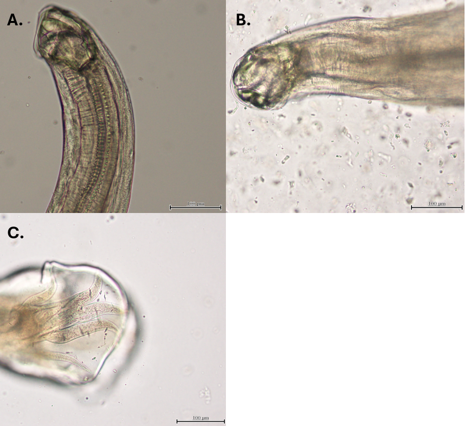

# **Whole genome annotation of *Uncinaria stenocephala*, a common hookworm of dogs and wildlife**

## **Background:**

*Uncinaria stenocephala* is the second most common canine hookworm, present throughout the world. This 'northern hookworm' has a temperate climate preference - in these climates it is the most common canine hookworm. Its wide distribution is contributed by its ability to infect wildlife, in particular foxes. *U. stenocephala* has been reported to been reported to be pathogenic in past literature; however, the consensus in the modern literature is that it is non-pathogenic.

## **Sampling:**

**We sampled red foxes (*Vulpes vulpes*) from NSW, Australia, to isolate this hookworm.** The species was confirmed by visual inspection of the buccal capsule, in particular looking for cutting plates - as figured in Supplementary Figure 1. There are no other hookworms of red foxes in Australia with cutting plates inside their buccal capsule.

The gastrointestinal tract of red foxes was excised within hours of the fox being culled, then stored in a domestic freezer until further processing. *U. stenocephala* was removed from the small intestine by running the mucous membrane through gloved fingers to dislodge the worms. The intestinal contents and the scraped contents were sieved under running water, before being placed onto a tray. Sifting through the sieved contents with a pipette, any hookworms encountered were examined under a compund microscope. Once identified the worm was stored in -80ºC. When needed for DNA or RNA isolations, the samples were defrosted and the genetic content isolated in accordance to the relevant materials and methods.

Illumina NovaSeq 6000 was prepared by following the genome isolation kit (**Monarch, but must check**). The sequencing was performed by the Ramacotti (**check spelling**) centre, UNSW, Australia.

**Figure 1 \| Buccal capsule and copulatory organ of sampled hookworms are consistent with that of *Uncinaria stenocephala*:** A. The side view of a buccal capsule of a sampled *U. stenocephala* presented, with the cutting plates present. B. Top down view of the buccal capsule. C. The copulatory organ of a male *U. stenocephala* is pictured.

## **Bioinformatic processing:**

Briefly, samples were assembled, decontaminated, soft masked and annotated de-novo or via homology. Greater detail is provided in the "General bioinformatic pipeline" branch, a full account of the specific methods used to produce results are in their respective pipeline for each gene family's individual branch.

## **Navigating this repository:** 

This repository is split into the "Main branch", the "General bioinformatic pipeline" branch and numerous branches for gene families of interest. **Each gene family of interest branch will feature the specifics of the project for that given gene family - or molecular function associated with a set of gene families - without repeating the over-arching bioinformatic pipeline.** It is hoped that this way the reader can easily navigate to the desired molecular function or branch without having to read excess detail.

## **General inquries:**

For general questions, please direct contact to Thomas Stocker (tsto3616\@uni.sydney.edu.au). Inquires or feedback are welcomed!
