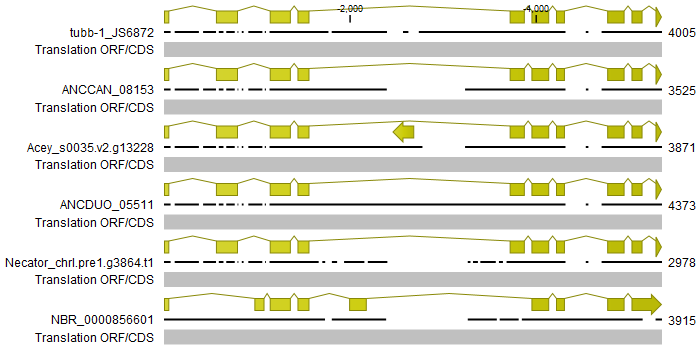

# **Annotating the tubulins:**

## **Background and reasoning:**

Tubulins are biologically important for their role in the formation of the cytoskeleton, specifically the microtubules. They are also the site of docking for the anthelmintic group - benzimidazoles. The binding pocket of the TUBB-1 protein, encoded by the 𝛽-tubulin isotype-1 (tubb-1) gene, is causally responsible for the susceptibility or resistance of nematodes to benzimidazoles. Thus the absence of full length, sequenced tubulins are concerning for the study of anthelmintic resistance in the canine hookworm *Uncinaria stenocephala*. Although our group obtained partial fragments of the gene, with some variants containing canonically resistant amino acid substitutions, these results remain ambiguous in the absence of a complete protein sequence. If there are amino acid differences in the TUBB-1 protein of *U. stenocephala* to that of other hookworms, then the substitutions cannot be referred to as resistant.

In addition, by sequencing alternative tubulins - of which there are three classes (⍺, 𝛽, 𝛾) - we can screen for novel anthelmintics.

## **tubb-1 workflow:**

The tubb-1 gene of *U. stenocephala* was isolated through a blastn search of both the JS6871 and JS6872 genomes. The JS6872 genome successfully produced a full length tubb-1 gene inferred through homology in comparison to an out group (*Nippostrongylus brasiliensis*) and the sequenced tubb-1 genes of four hookworms (*Ancylostoma caninum, Ancylostoma ceylanicum, Ancylostoma duodenale* and *Necator americanus*). The results were confirmed for adequate coverage for the exons, in particular the four canonically resistant SNPs. A detailed pipeline for these steps are provided below:

1.  Collate a fasta file for the blastn search of the tubb-1 gene, using the reference sequences (ANCCAN_08153, Acey_s0035.v2.g13228, ANCDUO_05511, Necator_chrI.pre1.g3864.t1) of the hookworms listed above. Then process the search with this fasta file (uploaded under this branch for file destination of tubb-1).
2.  Upload the promising results (determined by the length of matches) to CLC and align it to the results of step 3.
3.  Assemble a reference alignment of the four hookworms and the out group to compare the homology of the tubb-1 genes to the *U. stenocephala* scaffold. Make sure all tubulin reference files are aligned in the same orientation.
4.  Compare the scaffolds - for five prime and three prime orientations - to the references looking for gaps in the exons to confirm an absence of tubb-1. If there are no exon gaps then we proceeded to confirm amino acid conservation for the exons, conserved intron/ exon boundaries and an absence of stop codons in the exons. If all three criteria are consistent with the gene model, we proceed to translate the protein sequence. Only one scaffold was consistent with this gene model, the scaffold was trimmed to only include the scaffold.
5.  Confirm the presence of the tubb-1 gene of *U. stenocephala* to be consistent with past results, comparing the gene to our reference fragments - for which there was a near perfect match with no amino acid substitutions.
6.  Construct a CLC MainWorkbench pairwise matrix of amino acid substitutions for the *U. stenocephala* TUBB-1 and that of the reference sequences. The results of which are presented in Table 1
7.  Perform in-silico primer binding analyses in CLC MainWorkbench for the SNP167 (5' 3') and SNP200 (5' 3') primer sets to confirm the possibility of amplifying this gene, as previously performed, and report back the nucleotide mismatch frequency.
8.  Import the reference sequence of the tubb-1 gene of *U. stenocephala*, import it into Linux and preform reads mapping. Use this mapped reads file (.bed) to visualise the amount of heterogeneity in the sequence and to visualise coverage.
9.  Compare the tubb-1 gene of JS6872 (our reference) with that of JS6871 (which we failed to obtain a full sequence for).

## **tubb-1 results:**

The alignment of the references (out group included) is provided in Figure 1A, briefly - the tubb-1 gene retains exon structure across all the hookworms, including for the JS6872 (*U. stenocephala* sequence). There is shifting of the exons when the out group is compared to the hookworms. That said, the amino acid content of the four hookworms remains conserved (Table 1)

**Figure 1 \| Alignment of the references to the JS6872, *Uncinaria stenocepbala,* sample reveals conserved exon structures:** The listed sequences are in the order of: JS6872, *A. caninum, A. ceylanicum, A. duodenale, N. americanus* and *N. braziliensis* respectively. Note the gene heading in the 5' direction for *A. ceylanicum* (Acey_s0035.v2.g13228) is a secretory protein, not a feature of tubb-1.

**Figure 2 \| *Uncinaria stenocephala* slightly divergent from other hookworms:** All hookworms (apart from *U. stenocephala* remain identical, this is unlike that of the other hookworms. The sequences are ordered by JS6872, *A. caninum, A. ceylanicum, A. duodenale, N. americanus* and *N. braziliensis* respectively.

**Table 1 \| Pairwise distance matrix of the different protein sequences reveals a high level of conservation:** The TUBB-1 protein sequences of the various hookworms and the out group are featured in the order of: *U. stenocephala, A. caninum, A. ceylanicum, A. duodenale, N. americanus* and *N. braziliensis*.

|   | **TUBB-1 JS6872** | **Q2QJK8** | **A0A0D6MC88** | **A3FKG1** | **A3FKG2** | **A0A0N4XZG3** |
|----|----|----|----|----|----|----|
| **TUBB-1 JS6872** |  | 99.55 | 99.55 | 99.55 | 99.55 | 95.31 |
| **Q2QJK8** | 99.55 |  | 100 | 100 | 100 | 95.31 |
| **A0A0D6MC88** | 99.55 | 100 |  | 100 | 100 | 95.31 |
| **A3FKG1** | 99.55 | 100 | 100 |  | 100 | 95.31 |
| **A3FKG2** | 99.55 | 100 | 100 | 100 |  | 95.31 |
| **A0A0N4XZG3** | 95.31 | 95.31 | 95.31 | 95.31 | 95.31 |  |
